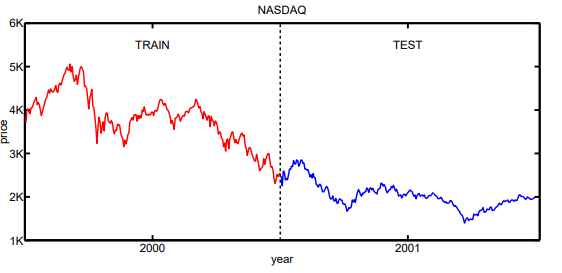

# Stock-Market-Prediction

This project applies a simple linear model to predict stock market prices. The files ${\tt nasdaq00.txt}$ and ${\tt nasdaq01.txt}$ contain the NASDAQ indices at the close of business days in 2000 and 2001.

  

How accurately can the index on one day be predicted by a linear combination of the three preceding indices? Using only data from the year 2000, the index is modeled by the log-likelihood  ${\cal L} = \sum_t \log P(x_t|x_{t-1},x_{t-2},x_{t-3})$ , where:

$$P(x_t|x_{t-1},x_{t-2},x_{t-3})\ =\
\frac{1}{\sqrt{2\pi}}\exp\left[-\frac{1}{2}\biggl(
  x_t - a_1 x_{t-1} - a_2 x_{t-2} - a_3 x_{t-3}\biggr)^2\right]$$

and the sum is over business days in the year 2000 (starting from the fourth day). The linear coefficients $(a_1,\!a_2,\!a_3)$ should be such that the log-likelihood  ${\cal L}$ is maximized.

In the code, the following equations are used to compute the linear coefficients that maximize ${\cal L}$
$${\cal L} = \sum_t \log P(x_t|x_{t-1},x_{t-2},x_{t-3})$$
$${\cal L} = \sum_t \log \left[\frac{1}{\sqrt{2\pi}}\exp\left[-\frac{1}{2}\biggl(x_t - a_1 x_{t-1} - a_2 x_{t-2} - a_3 x_{t-3}\biggr)^2\right]\right]$$
$${\cal L} = \sum_t \left[\log \frac{1}{\sqrt{2\pi}} + \log \left[\exp\left[-\frac{1}{2}\biggl(x_t - a_1 x_{t-1} - a_2 x_{t-2} - a_3 x_{t-3}\biggr)^2\right]\right]\right]$$
$${\cal L} = \sum_t \log \frac{1}{\sqrt{2\pi}} + \sum_t \log \left[\exp\left[-\frac{1}{2}\biggl(x_t - a_1 x_{t-1} - a_2 x_{t-2} - a_3 x_{t-3}\biggr)^2\right]\right]$$
$${\cal L} = \sum_t \log \frac{1}{\sqrt{2\pi}} - \sum_t \frac{1}{2}\biggl(x_t - a_1 x_{t-1} - a_2 x_{t-2} - a_3 x_{t-3}\biggr)^2$$
$$To\ maximize\ {\cal L},\ \frac{\partial {\cal L}}{\partial a_i} = 0\ for\ i \in \\{1, 2, 3\\}$$
$$\frac{\partial {\cal L}}{\partial a_i} = \sum_t x_{t-i} \biggl(x_t - a_1 x_{t-1} - a_2 x_{t-2} - a_3 x_{t-3}\biggr) = 0$$
$$\sum_t \biggl(x_{t-i} x_t - a_1 x_{t-i} x_{t-1} - a_2 x_{t-i} x_{t-2} - a_3 x_{t-i} x_{t-3}\biggr) = 0$$
$$\sum_t x_{t-i} x_t - a_1 \sum_t x_{t-i} x_{t-1} - a_2 \sum_t x_{t-i} x_{t-2} - a_3 \sum_t x_{t-i} x_{t-3} = 0$$
$$a_1 \sum_t x_{t-i} x_{t-1} + a_2 \sum_t x_{t-i} x_{t-2} + a_3 \sum_t x_{t-i} x_{t-3} = \sum_t x_{t-i} x_t$$

This can be written as a matrix equation like the one shown below :-

$$X  A = Y,\ where$$

$$X = \begin{pmatrix}
\sum_t x_{t-1}^2 & \sum_t x_{t-1} x_{t-2} & \sum_t x_{t-1} x_{t-3}\\
\sum_t x_{t-2} x_{t-1} & \sum_t x_{t-2}^2 & \sum_t x_{t-2} x_{t-3}\\
\sum_t X_{t-3} x_{t-1} & \sum_t x_{t-3} x_{t-2} & \sum_t x_{t-3}^2\\
\end{pmatrix}$$

$$A = 
\begin{pmatrix}
    a_1\\
    a_2\\
    a_3
\end{pmatrix}$$

$$Y = 
\begin{pmatrix}
    \sum_t x_t x_{t-1}\\
    \sum_t x_t x_{t-2}\\
    \sum_t x_t x_{t-3}
\end{pmatrix}$$

The matrix equation shown above is solved in the code to compute the linear coefficients. After solving,

* $a_1$ = 0.95067337
* $a_2$ = 0.01560133
* $a_3$ = 0.03189569

For the coefficients estimated above, a comparison of the model's performance (in terms of root mean squared error) on the data from the years 2000 and 2001 is shown below.

| Year | RMSE |
| --- | --- |
| 2000 | 117.908 |
| 2001 | 54.636 |

